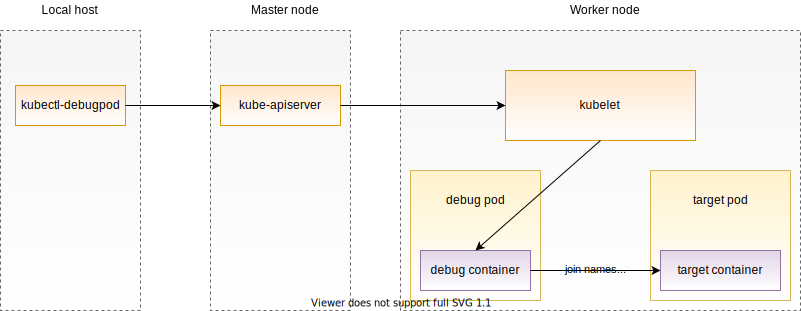

# kubectl-debugpod

*kubectl-debugpod* tool allows you to attach troubleshooting tools to running Kubernetes and/or OpenShift pods.

## How does it work?

The process of troubleshooting a running pod using *kubectl-debugpod* can be divided into the following steps:

1. *kubectl-debugpod* creates a privileged pod using a user-supplied container image. This debug pod is placed on the same cluster node where the target pod is running.
2. User's terminal is attached to the debug pod.
3. The shell running in the debug pod joins the Linux namespaces (*uts*, *ipc*, *net*, *pid*, and *cgroup*) of the target container.
4. User runs troubleshooting tools located on his/her container image, enjoying direct access to the processes running in the target container.
5. After the user is finished with troubleshooting, the debug pod is deleted.



## Installing kubectl-debugpod

Golang >= 1.13 is required. Build *kubectl-debugpod* using the command:

```
$ make build
```
Copy the resulting binary to your $PATH:

```
$ cp bin/kubectl-debugpod /usr/local/bin
```

## Usage

Check out the built-in help:

```
$ kubectl-debugpod -h
kubectl-debugpod, complete documentation is available at https://github.com/noseka1/kubectl-debugpod

Usage:
  kubectl-debugpod POD [flags]

Flags:
  -c, --container string   Target container name; defaults to first container in pod
  -h, --help               help for kubectl-debugpod
      --image string       Image used by the debug pod. (default "centos")
      --init-container     Target is an init container; defaults to false
  -n, --namespace string   Target namespace
```

The following sample session demonstrates attaching to an `apiserver-7484t` pod that is running in the `openshift-apiserver` namespace:

```
$ kubectl-debugpod apiserver-kbv54 --namespace openshift-apiserver
2020/04/28 14:04:04 Starting pod/apiserver-kbv54-debug-4wsft on node ip-10-0-157-30.us-west-2.compute.internal using image centos ...
If you don't see a command prompt, try pressing enter.
sh-4.4# hostname
apiserver-kbv54
sh-4.4# ps aux
USER         PID %CPU %MEM    VSZ   RSS TTY      STAT START   TIME COMMAND
root           1  0.7  1.3 791916 210568 ?       Ssl  Apr27  12:05 openshift-apiserver start --config=/var/run/configmaps/config/config.yaml
root          34  0.0  0.0  43960  3436 pts/0    R+   21:04   0:00 ps aux
sh-4.4# exit
exit
2020/04/28 14:05:05 Removing debug pod ...
```

For convenience, *kubectl-debugpod* comes with two mounts:

* `/host` The root directory of the underlying Kubernetes node is mounted here.
* `/target` The root directory of the target container is mounted here.

## Configuration file

*kubectl-debugpod* can read the configuration from a file located at `~/.kubectl-debugpod.yaml`. Sample configuration file:
```
image: quay.io/noseka1/openshift-toolbox:basic
```

## Tools image requirements

Your tools image can contain degugging/troubleshooting tools of your choice. In addition to that, make sure that you include the following utilities in your image as well. These utilities are used by *kube-debud-pod* to initialize the environment with the container:

* `/bin/sh`
* `chroot`
* `nsenter`
* `mount`
* `sed`

There are many tools images available out there. If you are troubleshooting on OpenShift, you can checkout my [openshift-toolbox](https://github.com/noseka1/openshift-toolbox) tools image.

## Limitations

* User must be permitted to create privileged containers.
* Following container runtimes are supported:
  * CRI-O
  * containerd
  * dockershim
  
  No further container runtimes are supported at this time.

## References

Kubernetes feature [Ephemeral Containers](https://github.com/kubernetes/enhancements/issues/277) that is currently in development.

Similar projects:

* [aylei/kubectl-debug](https://github.com/aylei/kubectl-debug)
* [verb/kubectl-debug](https://github.com/verb/kubectl-debug)
* [huazhihao/kubespy](https://github.com/huazhihao/kubespy)
